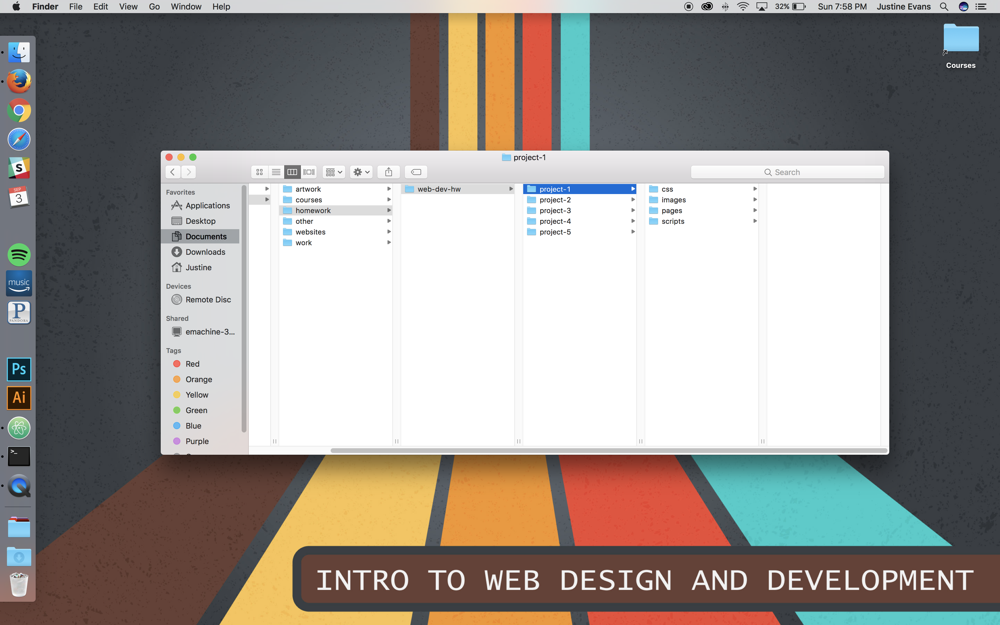

# My First README.md
## Justine Evans


This assignment was very difficult becuase I was confused by almost everything. But I am going to try my best to figure everything out.

---

I did a lot this week. First, I learned how to create a proper website directory, and how I should and **should not** name files:



--_

Next, I downloaded Atom and the GitHub Desktop Application, and tried to figure them out. I think I managed okay, and I even created and saved some new files!

- I learned Markdown.
- I even started learning HTML. I'll include an example:

```markdown
<p>This class is hard.</p>
<p>Like, really, really hard.</p>
<p>Just learning these paragraph tags was stupid intense.</p>
<p>But now I'm a master</p>
```
I won't give up, *not ever,* and I'm really excited to learn more about it.

___

I really want to learn all of these things, but first I need to master the website and how everything links. It's a little confusing right now, but I'm hoping I'll:

1. Develop some really cool websites.
2. Be able to remember all of these languages.
3. Be able to pass this class with flying colors.

I hope my sites never end up on [the Usless Web](http://www.theuselessweb.com/). *Or do I?*
